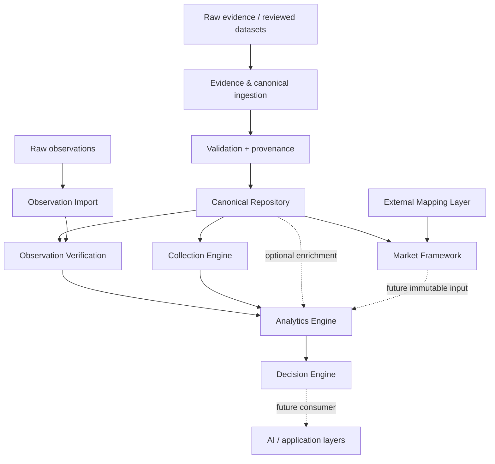

# MTG Lab Architecture Review v1

**Milestone:** Phase 77 — Architecture Consolidation & Technical Debt Review  
**Review date:** 2026-07-30  
**Architecture baseline:** Architecture v12 (unchanged)  
**Scope:** Repository-wide, documentation-only assessment of the implementation
merged through Phase 76.

## Executive assessment

MTG Lab has a sound pre-alpha architecture: immutable evidence and observations
enter through explicit boundaries; canonical identity is authoritative; derived
analytics and decisions flow downstream; and deterministic serialization,
validation, provenance, and create-only storage are recurring design properties.
The code is unusually well tested for its age (137 tests at review time), and the
newer market, collection, analytics, and decision packages are small and cohesive.

The principal debt is **consolidation debt, not a need for Architecture v13**.
Two generations coexist. The earlier schema-backed repositories and promotion
pipeline (`repository.cards`, `repository.products`, `repository.rules`) overlap
with the newer typed aggregate (`canonical.models`, `repository.canonical`) and
bulk canonical importer. Observation valuation also predates the generic Market
Framework, and observation summaries overlap the generic Analytics Engine. These
are compatible boundaries today, but parallel models, validators, snapshot types,
and serialization helpers can drift.

Architecture v12 should remain intact. Refactoring should preserve file formats,
public behavior, dependency direction, and audit history, and should proceed only
behind characterization tests. No defect identified by this review was changed.

## Review method and rating scale

The review inspected source packages, public re-exports, CLIs, schemas, retained
data, subsystem specifications, tests, CI configuration, and import relationships.
Ratings describe production readiness of the present bounded responsibility, not
the breadth of the future product: **5 Established**, **4 Operational**, **3
Developing**, **2 Foundation**, **1 Placeholder**.

## Dependency direction

The intended rule is monotonic authority: evidence may support canonical facts;
canonical facts may verify observations and ownership; immutable facts may feed
analytics; analytics may feed decisions. No arrow points back from analytics,
decisions, or AI into canonical storage.

## Cross-cutting strengths

- **Authority boundaries are explicit.** Observations and market snapshots cannot
  silently become canonical records, and decisions cannot mutate their inputs.
- **Reproducibility is designed in.** Stable hashing, sorted JSON, injected clocks,
  immutable value objects, and append/create-only repositories are common patterns.
- **Failure is conservative.** Unknown references, ambiguity, content conflicts,
  invalid relationships, and incompatible versions generally fail closed.
- **Interfaces exist at integration seams.** Source adapters, market providers,
  mapping repositories, analytics reports, and decision rules isolate variation.
- **Tests exercise invariants, not only happy paths.** Rollback, idempotency,
  provenance, referential integrity, immutability, CLI behavior, and deterministic
  replay all have direct coverage.
- **Documentation follows implementation.** Each Phase 68–76 subsystem has a v1
  contract and clearly states excluded behavior.

## Cross-cutting technical debt and risk register

| Priority | Debt or risk | Consequence | Recommended treatment |
| --- | --- | --- | --- |
| High | Two canonical domain representations and multiple repository loaders validate overlapping entities. | A record may be accepted, named, or represented differently depending on entry point. | Define one internal canonical read facade; adapt legacy loaders behind it without changing file contracts. |
| High | Canonical bulk import copies and replaces a complete game directory and has no inter-process lock. | Cost grows with repository size; concurrent writers could race despite per-process staging. | Document single-writer operation now; later add a lock and manifest-based transaction boundary with compatibility tests. |
| High | Provenance shapes vary across canonical entities, imports, evidence, observations, market snapshots, and analytics fingerprints. | Cross-subsystem lineage requires bespoke traversal and may drift. | Publish a shared provenance vocabulary and protocol; migrate adapters incrementally, retaining existing serialized fields. |
| Medium | `observations.market.MarketSnapshotStore` overlaps `market.MarketSnapshotRepository`; observation summary logic overlaps `AnalyticsService`. | Duplicate price/snapshot semantics and metrics can diverge. | Add compatibility adapters, then make observation workflows consume generic immutable types; do not rewrite retained artifacts. |
| Medium | Freeze/thaw, identifier validation, UTC normalization, stable JSON, atomic/create-only writes, and metadata validation are repeated. | Fixes must be repeated and edge behavior may differ. | Extract narrowly scoped internal utilities only after an inventory and characterization suite. Avoid a broad “utils” package. |
| Medium | Public imports are split between top-level packages and `mtglab.*` CLI namespaces. Names such as `analytics`, `collection`, and custom `ImportError` are collision-prone. | Packaging and embedding become harder; public API ownership is unclear. | Declare supported API symbols and gradually provide `mtglab.*` facades while preserving old imports. |
| Medium | File repositories repeatedly load entire trees and use linear tuple lookup. | Adequate for current data, but query and import time will degrade with a full multi-game catalog and market history. | Add in-memory ID indexes first; measure before considering an indexed persistence adapter. |
| Low | Several `__init__.py` files broadly re-export implementation symbols without explicit versioning policy. | Accidental APIs become difficult to retire. | Add documented `__all__` surfaces and API compatibility tests. |
| Low | Documentation status historically lagged Phases 68–76. | Planning can be based on obsolete implementation state. | Update inventory, roadmap, and changelog in every phase; consider a lightweight phase/status consistency check. |

## Subsystem assessments

### 1. Canonical Repository — **4/5 (Operational)**

**Responsibility and API.** `CanonicalRepository` supplies a validated, read-only,
game-scoped aggregate with typed entities and lookup methods; `apply_import` is its
staged write boundary. Older entity repositories remain authoritative for schema-
backed Card, Printing, Product, Print Sheet, and Slot loading and promotion.

**Architecture.** Cohesion inside the aggregate is good and relationship validation
is centralized. Dependency direction is correct: consumers depend on canonical
identity, never conversely. Coupling is elevated because the aggregate translates
documents already validated by older repositories into a second model whose field
names differ (`rarity` versus `rarity_id`, for example).

**Debt, scale, and extension.** Consolidate reading behind one facade; retain the
specialized repositories as adapters until schemas and promotion users converge.
Build ID indexes rather than scanning tuples in getters. Full-tree eager loading is
fine for the reference dataset but should become a selectable indexed backend before
full-catalog or multi-process use. Do not introduce a database merely to remove this
debt.

**Coverage.** Strong structural, relationship, deterministic output, invalid-path,
and duplicate tests; missing are concurrency, crash-at-each-rename-step, very large
catalog, and formal compatibility tests between legacy and typed representations.
Documentation is strong across architecture and repository specifications, though the
relationship between the two repository generations needs an explicit note.

### 2. Canonical Import Pipeline — **4/5 (Operational)**

**Responsibility and API.** `SourceAdapter`, `JSONSource`, `CSVSource`, and
`import_dataset` form a clear local reviewed-data boundary and return a deterministic
`ImportReport`. Transport is correctly kept out of canonical logic.

**Architecture.** The adapter seam is cohesive and extensible. The pipeline performs
mapping, defaulting, provenance construction, validation staging, change calculation,
and application, so it is approaching orchestration overload. It properly depends on
the repository, but also knows repository paths and entity-specific schema defaults.

**Debt, scale, and extension.** Split internal mapping/validation/planning steps while
keeping the public function stable. Replace broad exception suppression when reading
existing records with an explicit diagnostic (documented defect below). CSV support
will need typed decoding for lists and nested values before it is a general adapter.
Whole-tree copy validation is safe but scales with total game size rather than delta.

**Coverage.** Dry run, validation-only, rollback, duplicates, relationships,
determinism, and provenance are tested. Add adapter contract tests, malformed existing
state, CSV nested fields, concurrent import, and fault-injection tests. The v1 pipeline
document is concise and accurately bounded.

### 3. Observation Engine — **3/5 (Developing)**

**Responsibility and API.** The observation package owns immutable pack reports,
descriptive summaries, a legacy dated market snapshot store, and verification records.
`analyze_box` correctly describes observed contents rather than predicted EV.

**Architecture.** Its non-canonical boundary is excellent. Cohesion is reduced by
combining verification, descriptive analytics, and a market snapshot abstraction in
one package. `observations.analytics` predates and duplicates part of the generic
Analytics Engine; `observations.market` predates the generic Market Framework.

**Debt, scale, and extension.** Preserve retained observation formats, but introduce
read adapters into generic analytics and market models. Avoid adding new metrics to
the legacy summary module. Current file traversal and name indexing are suitable for
small studies; larger corpora need manifest indexes and streaming aggregation.

**Coverage.** Core ambiguity, immutability, valuation, and summary behavior is tested,
but the engine has only a small number of end-to-end scenarios. Add multi-box,
cross-game, corrupt history, high-volume, and generic-engine parity tests. The MB2-
titled document explains generic behavior but should eventually be renamed or paired
with a product-neutral observation contract.

### 4. Observation Import Pipeline — **4/5 (Operational)**

**Responsibility and API.** `parse_pack_text`, `ObservationImporter`, and its CLI
append raw packs, update a manifest, create verification records, and regenerate
descriptive analytics without touching canonical storage.

**Architecture.** The workflow is cohesive and conservative, though the importer is
coupled directly to canonical repository layout/index construction and to derived
analytics regeneration. Atomic file writes protect individual records; the multi-file
pack/manifest/verification/analytics operation is not one transaction.

**Debt, scale, and extension.** Separate append planning from derived-view refresh,
and inject a canonical lookup protocol. Document single-writer semantics or add a box
lock before concurrent ingestion. Manifest allocation currently implies linear work
and should be indexed if observation volume grows.

**Coverage.** Parsing, append behavior, legacy verification creation, conflict safety,
and CLI paths are covered. Add crash recovery between writes, concurrent allocation,
partial manifest, Unicode collision, and very large box tests. Workflow documentation
is detailed and accurate.

### 5. Verification — **4/5 (Operational)**

**Responsibility and API.** `ObservationVerifier` normalizes reported names and emits
verified, ambiguous, or unmatched outcomes; `VerificationStore` persists immutable,
hash-bound records. Evidence handoff verification separately validates integrity,
provenance, completeness, and claim consistency before canonical consideration.

**Architecture.** Both verification paths fail closed and preserve source facts.
They appropriately depend on validation/canonical reads. The shared word
“verification” describes related policies implemented in separate packages, with no
common result/finding protocol.

**Debt, scale, and extension.** Keep domain-specific verifiers, but standardize finding
severity, codes, timestamps, and source hashes. Name-only observation matching will
remain ambiguous by design; extension should add explicit match strategies rather
than heuristic auto-resolution. Precomputed canonical lookup indexes will be needed
at catalog scale.

**Coverage.** Good negative-path coverage exists for integrity, provenance,
completeness, duplicates, conflicts, and ambiguity. Add protocol-level tests and
normalization property/fuzz cases. Evidence Review documentation is extensive;
observation verification is documented inside an MB2-specific document.

### 6. Provenance — **3/5 (Developing, cross-cutting)**

**Responsibility and API.** Provenance connects archived bytes and Source Records to
parsed/candidate fields, promotion audits, canonical records, observations, provider
metadata, collection acquisitions, analytics fingerprints, and decision facts.

**Architecture.** Coverage is a major strength, but there is no shared provenance
model or traversal API. Similar concepts use `source_id`, `source_location`, free-form
metadata, observation IDs, hashes, or analytics fact paths depending on subsystem.
This is architectural drift in representation, not direction.

**Debt, scale, and extension.** Define a minimal protocol (artifact identity, source
identity, content hash, transformation/version, timestamp, claim/field locator) and a
lineage reader capable of adapting existing records. Do not migrate or rewrite old
audits. Future scale requires lineage queries without opening every JSON file.

**Coverage.** Individual provenance gates are well tested; end-to-end lineage from
evidence through canonical/collection/analytics/decision is not. Documentation is
distributed and needs a single cross-cutting index.

### 7. Market Framework — **4/5 (Operational)**

**Responsibility and API.** `MarketProvider`, `MarketService`, validated price models,
and `MarketSnapshotRepository` isolate provider retrieval, caching, canonical printing
validation, normalization, and append-only persistence.

**Architecture.** Provider inversion and downstream normalized snapshots are strong.
The service is appropriately coupled to a small canonical `get_printing` capability.
The manual provider proves the boundary without vendor/network assumptions. Overlap
with the observation snapshot store is the main drift.

**Debt, scale, and extension.** Extract repository/provider protocols for easier
composition; converge legacy observation valuation through an adapter. Real providers
will require explicit retry/rate-limit/error taxonomies and secure credential handling
inside adapters. File-per-snapshot storage needs date/provider partitioning or an
indexed backend for long histories.

**Coverage.** Strong model, cache, timestamp, canonical reference, repository, CLI,
and provider substitution coverage. Live-adapter contract and high-volume history
tests are naturally absent. Documentation is comprehensive and candid about v1 limits.

### 8. External Mapping Layer — **4/5 (Operational)**

**Responsibility and API.** Immutable mapping sets connect canonical printing IDs to
opaque provider product/SKU identities, with lifecycle, provenance, exact resolution,
validation, and versioned append-only import.

**Architecture.** This is a cohesive anti-corruption layer and correctly points from
external identities toward canonical identity. Explicit version selection and exact
finish/language matching avoid hidden provider assumptions.

**Debt, scale, and extension.** `market.mappings` combines models and file repository;
split only if adapter growth warrants it. Resolution scans records and will need an
index for large providers. Define version retirement/discovery policy before many
versions accumulate; do not add implicit “latest” resolution.

**Coverage.** Active/pending state, ambiguity, canonical validation, append-only
storage, mapped-provider behavior, and case-sensitive opaque IDs are well covered.
Add migration/version-discovery and large-set performance tests. Documentation is
strong and includes a concrete interchange example.

### 9. Collection Engine — **4/5 (Operational)**

**Responsibility and API.** Immutable ownership aggregates and `CollectionService`
provide add/remove/move/split/merge/query/summary operations; `CollectionRepository`
round-trips local snapshots. Printing identity is canonical and acquisition history is
preserved.

**Architecture.** Models, service, and repository are cleanly separated. Canonical
validation is currently duck-typed through a repository supplied to the service,
which is useful but undocumented as a protocol. UUID-owned-card identifiers make new
operations intentionally non-replay-identical unless IDs are supplied/retained.

**Debt, scale, and extension.** Declare canonical lookup and ID-generation protocols,
and consider indexed aggregate internals when collections become large. File snapshot
persistence is single-user/single-writer; event history, sync, and conflict resolution
are future concerns, not present defects. Keep valuation downstream.

**Coverage.** Quantity arithmetic, merge compatibility, canonical validation,
summaries, immutability, and persistence are covered. Add deck-assignment operations,
concurrent save/conflict, schema migration, and large-collection tests. Documentation
clearly states boundaries and future integration.

### 10. Analytics Engine — **4/5 (Operational)**

**Responsibility and API.** `AnalyticsService` produces seven immutable,
fingerprinted, deterministic fact reports from caller-supplied collection,
observation, and optional canonical snapshots. It performs no I/O.

**Architecture.** This is a strong functional core. Input detachment and stable report
envelopes give downstream decisions a reliable contract. Direct imports from
`collection.models` are acceptable now but a snapshot protocol would reduce coupling.
Observation shape handling belongs in adapters as formats multiply.

**Debt, scale, and extension.** Consolidate legacy observation metrics here through
adapters; centralize the duplicated recursive freeze/thaw and stable hashing behavior.
Current reports aggregate in memory and should accept iterables/streaming snapshots
before observation or collection data becomes large. Version each report result shape,
not only the common envelope, if third-party consumers emerge.

**Coverage.** Every documented report family, immutability, fingerprints,
determinism, canonical enrichment, and CLI output is tested. Add malformed snapshot,
schema compatibility, streaming-scale, and cross-engine parity tests. Documentation
is strong; punctuation and naming should consistently distinguish seven reports.

### 11. Decision Engine — **4/5 (Operational)**

**Responsibility and API.** Immutable decisions and reports evaluate explicit,
versioned rules over analytics facts with stable evidence paths and explanations.
`DecisionService` is stateless and read-only.

**Architecture.** Dependency direction is exemplary: decisions depend only on
analytics contracts and never repositories. Generic `DecisionRule` plus named rule
families is cohesive, though subclasses currently offer more semantic naming than
behavioral specialization. Fact paths are strings and therefore couple rules to
untyped report result shapes.

**Debt, scale, and extension.** Add a report-fact catalog or validation protocol so
rule configuration can be checked before runtime without introducing a new reasoning
engine. Keep rules explicit and versioned. At scale, index reports by type and compile
fact accessors; preserve deterministic ordering and complete evaluation traces.

**Coverage.** Rule validation, operators, missing facts, stable identifiers,
explanations, report generation, family APIs, and CLI behavior are covered. Add rule
version migration, multiple reports of one type, result-shape compatibility, and
large-rule-set tests. Documentation is accurate and appropriately excludes AI/ML.

## Documented defects (not fixed in Phase 77)

1. **Malformed existing canonical JSON is ignored during import change counting.**
   `import_dataset` catches every exception while reading an existing target and then
   treats that path as newly created. Prospective repository validation will usually
   fail earlier for malformed state, but broad suppression obscures the actual cause
   and can misreport plans in edge cases. Replace it with a typed `ImportError` after
   a focused regression test.
2. **Bulk import is not safe for concurrent writers.** Staging and rename protect a
   single invocation, not two processes planning against the same game root. Until a
   lock exists, documentation and operational tooling should enforce one writer.
3. **Observation append is a multi-file, non-transactional workflow.** A process
   failure can leave a pack, manifest, verification, and analytics view temporarily
   inconsistent. Existing validation supports detection, but no recovery command or
   transaction journal is defined.
4. **CSV import does not decode nested canonical values.** `csv.DictReader` yields
   strings, while IDs arrays and sheet entries require structured values. CSV is safe
   only for scalar-compatible entity shapes unless an adapter performs decoding.

These findings require separately approved code milestones. None currently justifies
redesigning Architecture v12 or breaking a public API.

## Recommended consolidation sequence

1. **Publish contracts first:** supported public symbols, canonical lookup protocol,
   snapshot/report protocols, provenance vocabulary, and single-writer assumptions.
2. **Characterize overlap:** parity tests for canonical loaders, observation/generic
   analytics, and the two market snapshot representations.
3. **Introduce adapters:** one canonical read facade and legacy observation-to-market
   and observation-to-analytics adapters, with no retained-data rewrite.
4. **Extract narrow primitives:** stable JSON/hash, UTC normalization, immutable
   mapping conversion, identifier checks, and atomic/create-only file operations.
5. **Add indexes behind interfaces:** canonical IDs, mapping resolution, and manifest
   lookup. Benchmark before selecting database or event-store infrastructure.
6. **Harden write coordination:** locks, recovery tests, and explicit transaction
   manifests for canonical import and observation append.

## Future scaling considerations

- **Catalog scale:** lazy/indexed canonical lookup, cached schema validation, and
  delta-aware import planning are enough before a database is warranted.
- **History scale:** market and observation stores should partition by game,
  provider/product, and date, with immutable manifests and optional indexed readers.
- **Compute scale:** analytics should consume immutable iterables and emit versioned
  partial aggregates that can be reduced deterministically.
- **Concurrency:** every mutable boundary needs an explicit single-writer lock or
  compare-and-swap generation; create-only leaf files alone are insufficient.
- **Multi-game extension:** keep product/provider logic in adapters and test generic
  services with a second synthetic game before claiming portability.
- **API evolution:** version serialized contracts, expose stable `mtglab.*` facades,
  and retain compatibility adapters for top-level packages.
- **Lineage:** an indexed provenance graph should be a read model over immutable
  records, not a replacement authority or a reason to rewrite audit history.
- **Operations:** add performance baselines, corruption/recovery drills, dependency
  boundary checks, and documentation consistency checks to CI as repository volume
  and contributor count grow.

## Conclusion

The repository has reached a coherent vertical slice from evidence and canonical
identity through observation, ownership, analytics, and explainable decisions. The
correct next architectural work is careful consolidation: reduce duplicate internal
representations, formalize protocols, and strengthen transaction/index behavior while
preserving Architecture v12 and all existing contracts. Feature expansion should not
precede characterization of the overlapping canonical, observation analytics, market,
and provenance paths.
